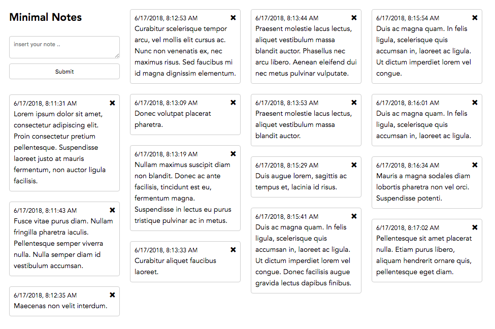

<h1 align="center">Minimal Notes</h1>

 Simple Notes web app build with Vue.js made for PC or Tablet 

 There are many notes apps, but I needed something simple that works for me on my laptop. That is why I made minimal notes that will work in my browser locally. Everything is stored in your web browser localStorage. All the coding is done with Vue.js and the best part is everything is in the index.html file that is only 4Kb. 

I also made Minimal Notes.app for Mac OS users. First I used <a href="https://electronjs.org">Electron</a> to package the app. But the file from 4Kb become 400 Mb, with some optimisation I achieved around 140 Mb but I was not happy. Then I tried <a href="https://cordova.apache.org/docs/en/latest/guide/platforms/osx/">Cordova for Mac</a> and worked perfectly. The file become 0.45 Mb that is much better then 140 Mb.

<h3>You can use it from here or download it locally</h3>

<a href="https://vladocar.github.io/Minimal-Notes/">https://vladocar.github.io/Minimal-Notes/</a>

<h3>License</h3>

This project is licensed under the MIT License
